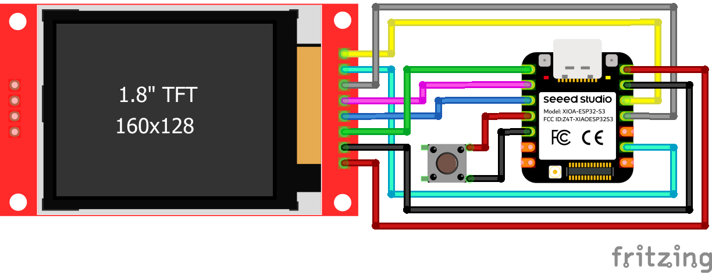

# XIAO ESP32-S3 Sense Retro Camera

This project is a compact digital camera implementation using the Seeed Studio XIAO ESP32-S3 Sense development board and a 1.8" TFT display. It features high resolution photo capture, AVI video recording, and a live viewfinder, utilizing FreeRTOS for multitasking and stability.

## Features

- **Photo Capture:** Saves high definition JPEG images to the SD card.
- **Video Recording:** Records MJPEG video streams in an AVI container format.
- **Live Viewfinder:** Real time camera feed displayed on the TFT screen.
- **Smart Scaling:** Video feed is scaled to fit the screen without distortion during recording.
- **Hardware Mirroring:** Toggle horizontal mirroring using the built in Boot button.
- **Multitasking:** Uses FreeRTOS tasks to handle UI/Camera and SD card monitoring on separate cores.

## Hardware Required

- **Microcontroller:** Seeed Studio XIAO ESP32-S3 Sense (with Camera & SD Card expansion board).
- **Display:** 1.8" TFT Display (ST7735S driver, 128x160 resolution).
- **Button:** 1x Push button (for shutter control).
- **Storage:** MicroSD Card (FAT32 formatted).
- **Wiring:** Wires for connections.

## Pin Configuration

  
    
  <table>
    <tr>
      <td valign="top" align="center">
        <h3>TFT Display</h3>
        <table>
          <tr>
            <th>TFT Pin</th>
            <th>XIAO ESP32-S3 Pin</th>
          </tr>
          <tr>
            <td>VCC</td>
            <td>5V</td>
          </tr>
          <tr>
            <td>GND</td>
            <td>GND</td>
          </tr>
          <tr>
            <td>CS</td>
            <td>GPIO 1</td>
          </tr>
          <tr>
            <td>RESET</td>
            <td>GPIO 3</td>
          </tr>
          <tr>
            <td>A0 / DC</td>
            <td>GPIO 2</td>
          </tr>
          <tr>
            <td>SDA</td>
            <td>GPIO 9</td>
          </tr>
          <tr>
            <td>SCK</td>
            <td>GPIO 7</td>
          </tr>
          <tr>
            <td>LED</td>
            <td>3.3V</td>
          </tr>
        </table>
      </td>
      <td width="20"></td> <td valign="top" align="center">
        <h3>Shutter Button</h3>
        <table>
          <tr>
            <th>Button Leg</th>
            <th>XIAO ESP32-S3 Pin</th>
          </tr>
          <tr>
            <td>Leg 1</td>
            <td>GPIO 4</td>
          </tr>
          <tr>
            <td>Leg 2</td>
            <td>GPIO 5</td>
          </tr>
        </table>
      </td>
    </tr>
  </table>

## Installation

1. **Install Arduino IDE:** Ensure you have the latest version of the Arduino IDE.
2. **Install Board Package:** Add the ESP32 board manager URL and install the "esp32 by Espressif Systems" package (version 3.x or later).
3. **Select Board:** Choose "XIAO_ESP32S3" from the Tools > Board menu.
4. **PSRAM Setting:** Enable PSRAM (OPI) in the Tools menu.
5. **Install Library:** Install the `LovyanGFX` library via the Arduino Library Manager.
6. **Upload:** Connect your board and upload the `XIAO-ESP32S3-Sense_Retro_Camera.ino` sketch.

## Usage

### Taking a Photo
- **Action:** Short press the shutter button (less than 1 second).
- **Result:** The screen will freeze momentarily while the HD JPEG image is saved to the SD card. A confirmation message will appear.

### Recording Video
- **Action:** Long press the shutter button (more than 1 second).
- **Result:** Video recording starts. The screen will display a red recording indicator.
- **Stop Recording:** If you press the button again, recording stops upon release.
  - If you press again immediately after the video starts, recording continues (locked mode). At least 2 seconds has to pass.
- **Note:** The video is saved as an `.avi` file.

### Mirroring
- **Action:** Press the small "Boot" button on the XIAO board.
- **Result:** The camera preview horizontally flips (selfie mode vs. normal mode).

## Technical Details

- **Video Format:** MJPEG encoded video stream inside an AVI container. Resolution is set to HVGA (480x320) for optimal performance.
- **File System:** Files are named sequentially (e.g., `hd_pic_1.jpg`, `vid_2.avi`). The counter is stored in the EEPROM to persist across resets.

## License

This project is licensed under the MIT License. See the LICENSE file for details.
