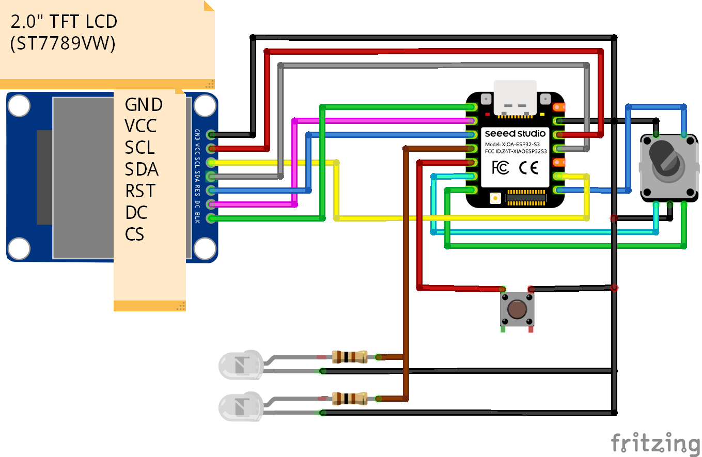

# XIAO ESP32-S3 Sense Retro Camera

A compact retro-styled digital camera built on the Seeed Studio XIAO ESP32-S3 Sense. Captures high-resolution photos and MJPEG/PCM audio video, with a live viewfinder on a 2.0" TFT display. Features a full encoder-driven menu system with on-device gallery (including video thumbnail previews), camera settings, and a tabbed wireless file manager. Modular codebase with a multi-task FreeRTOS architecture for robust, concurrent operation.

---

## Features

- **High-Resolution Photo Capture** — HD JPEG images (1280×720) saved to SD card
- **Video Recording with Audio** — MJPEG video at 480×320, 10 FPS, with 16 kHz mono PCM audio via the built-in PDM microphone, saved as `.avi`
- **Live Viewfinder** — Real-time 320×240 RGB565 camera preview on the TFT display
- **Main Menu** — Encoder-driven main menu with Gallery, WiFi Transfer, Camera Settings, and Exit options
- **Camera Settings** — On-device configuration of 9 sensor parameters (brightness, contrast, saturation, AE level, white balance, special effects, mirror, flip, JPEG quality) with NVS persistence
- **FPS Counter & SD Status** — Live overlay showing frame rate and SD card health
- **WiFi File Server** — AP mode with a tabbed HTML file manager (Photos / Videos tabs with file count badges, alphabetically sorted); download, preview, or delete assets wirelessly with video thumbnail support
- **On-Device Gallery** — Browse photos and videos on the TFT; video items show a thumbnail preview (frame ~1.2 s into the clip) with a play button, filename, and size overlaid on dark strips
- **Silent Video Playback** — Plays AVI recordings on the TFT by parsing MOVI JPEG chunks; frame timing derived from the AVI header's `microSecPerFrame` for accurate real-time speed; pause/resume/stop via encoder
- **File Deletion** — Delete photos and videos directly from the device with a confirmation dialog
- **Reliable AVI Encoding** — Accurate `idx1` index table built from actual chunk write order; `microSecPerFrame` derived from declared target FPS; `endAVI()` safely handles SD removal mid-recording
- **A/V Synchronisation** — I2S DMA geometry tuned to drain exactly one video frame's worth of audio per read (`AUDIO_BYTES_PER_FRAME = 3200` bytes, 10×320-byte DMA slots); fixes cumulative drift
- **Atomic Multi-Core Synchronisation** — `std::atomic<int>` for all inter-core display-buffer state, preventing SMP data races
- **PSRAM Efficiency** — Separate `DISP_BUF_SIZE` (160 KB) and `REC_BUF_SIZE` (80 KB) buffer pools save 240 KB PSRAM; AVI metadata arrays allocated once at boot and `memset` per session

---

## Hardware

| Component | Part |
|---|---|
| Microcontroller | Seeed Studio XIAO ESP32-S3 Sense (OV2640 + SD card expansion) |
| Display | 2.0" TFT LCD — ST7789VW, 240×320, SPI |
| Rotary Encoder | EC11 with push button (CLK: GPIO 6, DT: GPIO 43, SW: GPIO 44) |
| Shutter button | 1× tactile button (GPIO 4 / GPIO 5) |
| Storage | MicroSD card, FAT32 formatted |
| Power | 3.7 V Li-ion battery or USB-C |

---

## Pin Configuration

<div align="center">
  
  <br><br>
  <table>
    <tr>
      <td valign="top" align="center">
        <h3>TFT Display (ST7789VW)</h3>
        <table>
          <tr><th>TFT Pin</th><th>GPIO</th></tr>
          <tr><td>GND</td><td>GND</td></tr>
          <tr><td>VCC</td><td>3.3 V</td></tr>
          <tr><td>SCL (SCK)</td><td>GPIO 7</td></tr>
          <tr><td>SDA (MOSI)</td><td>GPIO 9</td></tr>
          <tr><td>RESET</td><td>GPIO 3</td></tr>
          <tr><td>DC</td><td>GPIO 2</td></tr>
          <tr><td>CS</td><td>GPIO 1</td></tr>
        </table>
      </td>
      <td width="20"></td>
      <td valign="top" align="center">
        <h3>Buttons & Control</h3>
        <table>
          <tr><th>Function</th><th>GPIO</th></tr>
          <tr><td>Encoder CLK</td><td>GPIO 6 (INPUT_PULLUP)</td></tr>
          <tr><td>Encoder DT</td><td>GPIO 43 (INPUT_PULLUP)</td></tr>
          <tr><td>Encoder SW (Button)</td><td>GPIO 44 (INPUT_PULLUP)</td></tr>
          <tr><td>Shutter — leg 1</td><td>GPIO 4 (OUTPUT)</td></tr>
          <tr><td>Shutter — leg 2</td><td>GPIO 5 (INPUT_PULLUP)</td></tr>
          <tr><td>Boot button</td><td>GPIO 0 (disabled — mirror via Settings menu)</td></tr>
          <tr><td>SD Card CS</td><td>GPIO 21</td></tr>
          <tr><td>Mic CLK (PDM)</td><td>GPIO 42</td></tr>
          <tr><td>Mic DATA (PDM)</td><td>GPIO 41</td></tr>
          <tr><td colspan="2"><em>TFT and SD share SPI2_HOST (MISO: GPIO 8)</em></td></tr>
        </table>
      </td>
    </tr>
  </table>
</div>

---

## Installation & Setup

### PlatformIO (Recommended)

1. Install **Visual Studio Code** with the PlatformIO extension
2. Clone / open this folder in VS Code
3. PlatformIO auto-detects `seeed_xiao_esp32s3` from `platformio.ini`
4. **Build:** `PlatformIO: Build`
5. **Upload:** Connect XIAO via USB-C → `PlatformIO: Upload`
6. **Monitor:** Serial monitor at **115200 baud**

### Arduino IDE

1. Board Manager URL: `https://raw.githubusercontent.com/espressif/arduino-esp32/gh-pages/package_esp32_index.json`
2. Install **esp32 by Espressif Systems** (v3.x+)
3. Board: **XIAO_ESP32S3** | PSRAM: **OPI PSRAM**
4. Install **LovyanGFX** via Library Manager
5. Open `src/main.cpp` (or the whole project folder), upload

---

## Usage

### Taking a Photo
- **Short press** (< 1 s) the shutter button
- Camera switches to HD mode, captures, saves → `/pic_N.jpg`
- Screen shows "HOLD ON…" then "PIC SAVED #N"

### Recording Video
- **Long press** (> 1 s) the shutter button to start
- Records MJPEG + PCM audio → `/vid_N.avi`
- Screen shows blinking red indicator + elapsed time HH:MM:SS
- **Press again** to stop (minimum 2 s of recording)

### WiFi File Manager
- Select **WiFi Transfer** from the main menu (requires SD card)
- Connect your phone/PC to `Retro_Cam` (password: `barkinsarikartal`)
- Navigate to `http://192.168.4.1` — tabbed interface: **Photos** and **Videos** tabs, each sorted alphabetically with file count badges
- Both photos and videos display thumbnail previews; video thumbnails are extracted from frame ~1.2 s into the clip
- Press the encoder click/long to exit WiFi mode and resume camera

### SD Card Status
- **Green dot** (bottom-right) = SD ready
- **Red dot** = card missing, full, or error
- Recording auto-stops if card is removed or full

### Menu System
- **Encoder click** from Idle → Main Menu
- **Turn** (CW / CCW) to highlight an option, **click** to select
- **Long press** at any level = go back (universal)
- Menu items: **Gallery**, **WiFi Transfer**, **Settings**, **Exit**

### Gallery (Photos & Videos)
- Select "Gallery" from the main menu → Gallery type selector (Photos / Videos)
- **CW / CCW** to switch between types, **click** to enter
- **In Photo Gallery:** CW/CCW to browse, click to open delete dialog (Cancel / Delete)
- **In Video Gallery:** CW/CCW to browse; each video displays a thumbnail preview with play button, filename, and file size overlaid; click to play directly
- **During Video Playback:** plays at accurate real-time speed (frame timing from AVI header); click to pause/resume, long press to stop → delete dialog
- **File Deletion:** Confirmation dialog with Cancel/Delete before removing from SD
- **Shutter button** exits any menu/gallery state immediately (emergency exit)

### Camera Settings
- Select "Settings" from the main menu
- **CW / CCW** to browse the 9 parameters (scrollable list)
- **Click** to enter edit mode (highlighted row turns yellow)
- **CW / CCW** to adjust the value within its valid range
- **Click** to confirm and save to NVS
- **Long press** in edit mode cancels the change
- **Long press** in browse mode returns to the main menu
- Available settings: Brightness, Contrast, Saturation, AE Level, White Balance, Special Effect, Mirror, Flip, JPEG Quality

---
### Source Code Structure

| File | Responsibility |
|---|---|
| `shared.h` | Common includes, defines, structs, enums, LGFX class, extern declarations, prototypes |
| `main.cpp` | setup/loop, FreeRTOS tasks (capture, display, recorder, input, SD monitor), ISRs, camera/mic init |
| `avi_writer.cpp` | AVI file creation: startAVI, writeAVIFrameFromBuf, writeAVIAudioChunk, endAVI |
| `wifi_server.cpp` | WiFi AP + async web server with tabbed HTML file manager |
| `gallery.cpp` | On-device gallery: photo/video browsing, AVI frame extraction, video playback |
| `settings.cpp` | Camera settings: NVS load/save, applySettings, settings & main menu UI |


## Technical Details

### Recording Configuration

| Setting | Live Preview | Photo | Video |
|---|---|---|---|
| Format | RGB565 | JPEG | JPEG |
| Resolution | QVGA 320×240 | HD 1280×720 | HVGA 480×320 |
| Target FPS | — | — | 10 |
| JPEG Quality | — | 12 | 12 |

### A/V Synchronisation

Audio timing is pinned exactly to video frame rate:

```
AUDIO_SAMPLE_RATE       = 16 000 Hz
TARGET_FPS              = 10
AUDIO_SAMPLES_PER_FRAME = 1 600
AUDIO_BYTES_PER_FRAME   = 3 200

I2S DMA: dma_frame_num=160 → 320 bytes/slot
         3200 / 320 = 10 slots = exactly 1 video frame interval
```

Every video frame always receives one audio chunk (zero-padded if the DMA hasn't filled completely). `microSecPerFrame` in the AVI header is written from `TARGET_FPS`, not a variable post-recording average.

### File Storage

| File | Path pattern | Counter storage |
|---|---|---|
| Photo | `/hd_pic_N.jpg` | NVS (`cnt` namespace) |
| Video | `/vid_N.avi` | NVS (`cnt` namespace) |

### FreeRTOS Task Architecture

| Task | Core | Priority | Stack | Responsibility |
|---|---|---|---|---|
| taskSDMonitor | 0 | 1 | 4 KB | SD health, free space, removal detection (skips SPI polling during recording) |
| taskInput | 0 | 2 | 4 KB | Button/encoder debounce, menu state machine |
| taskRecorder | 0 | 4 | 8 KB | SD write, I2S audio read, AVI chunk output |
| taskDisplay | 1 | 3 | 16 KB | TFT frame rendering, menus, gallery UI, video playback |
| taskCapture | 1 | 6 | 8 KB | Camera capture, state transitions, display/recorder buffer copy |

**Synchronisation primitives:**
- `spiMutex` — serialises all SPI bus access (TFT + SD share `SPI2_HOST`)
- `std::atomic<int>` — dispWriteSlot, dispReadSlot, dispRendering (inter-core display state)
- `recFrameQueue` — decouples capture from SD write (3-slot PSRAM pool)
- `recPoolFree` semaphore — backpressure: slows capture when SD is slow

---

## Assembly & Power Notes

Components are soldered on perfboard, powered by a 3.7 V 18650 Li-ion cell.

> **Important:** When powered via the battery connector, the XIAO's 5 V pin is disabled. Connect the **TFT VCC and LED to 3.3 V** to ensure correct operation on battery power.

---

## Troubleshooting

| Symptom | Check |
|---|---|
| "Cam init error" in serial | USB power ≥ 500 mA; OV2640 ribbon cable seated |
| Inverted colours on TFT | Toggle `pcfg.invert` in `initCamera()` |
| SD not detected | FAT32 format; < 32 GB recommended; check GPIO 21 CS |
| AVI won't play | Use VLC; some players don't support MJPEG in AVI |

---

## Performance

| Metric | Typical value |
|---|---|
| Viewfinder FPS | 15–25 FPS |
| Photo save time | 3–5 seconds |
| Video recording FPS | 9–10 FPS |
| RAM usage | ~18% of 320 KB |
| Flash usage | ~38% of 3.3 MB |

---

## License

MIT License — see `LICENSE` for details.
